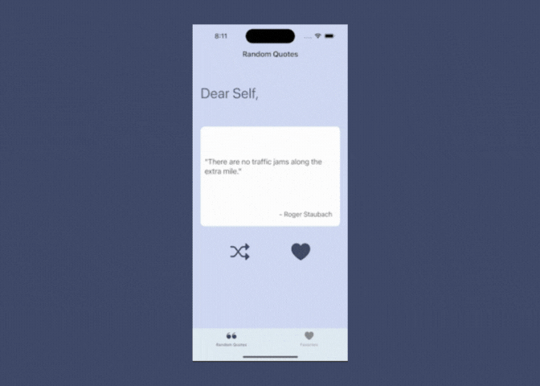
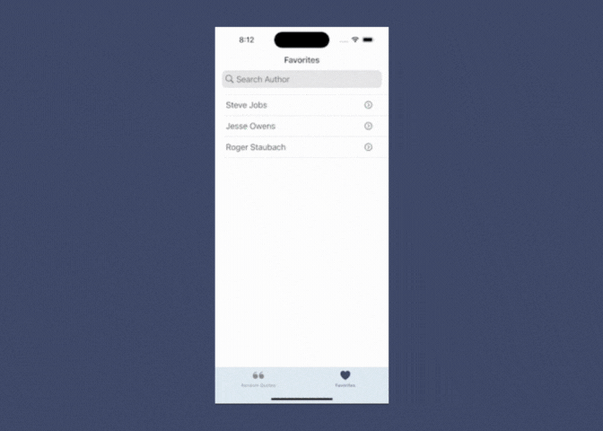

# Power Quotes 

## Table of contents

- [Overview](#overview)
  - [Description](#description)
  - [Features](#features) 
- [Architecture Pattern](#architecture-pattern)
  - [Models](#models)
  - [Views](#views)
  - [Controllers](controllers)
- [UI Design](#ui-design)
  - [Random Quote Screen](#random-quote-screen)
  - [Favorites Table Screen](#favorites-table-screen)
  - [Favorite Quote Screen](#favorite-quote-screen)
- [Author](#author)

## Overview

### Description

Power Quotes iOS application displays quotes from influential people provided by [Dummy JSON](https://dummyjson.com/) quote API. Power Quote's purpose is to provide a burst of wisdom to get you back focused.  

### Features

- Display a random quote from API with a click of a button.
- Add a quote to your favorites.
- Filter list of favorites by Author.
- Share your favorite quote.
- Remove unwanted quotes from the list of favorites.

### Screenshots

## Architecture Pattern

Power Quotes application leverages the MVC architectural pattern. I chose MVC because of the simplicity of the app, it has a small number of models and views, and there is no complex functionality. Because of those facts, the app benefited the most from using MVC over MVVM, which would have added unnecessary complexity. Some of the benefits of the approach are: 
  - I can make updates to view designs without affecting models or logic.
  - Components can be easily tested.
  - I can reuse my models or views in other parts of the app.
  - I can add new features or screens to the app since each component can be developed and tested independently.
  - My code codebase is easy to understand.
  

### Models

- Quote.swift

  A struct that represents a quote from the API. It has the following properties:
    - `id`: An integer representing the unique ID of the quote.
    - `quote`: A string containing the text of the quote.
    - `author`: A string containing the name of the author of the quote.

  The `Quote` struct conforms to the `Decodable` protocol, which means it can be initialized from a JSON object. 

- Favorite.swift

  A struct that represents a favorite quote that a user has saved. It has the following properties:
    - `quote`: A string containing the text of the quote.
    - `author`: A string containing the name of the author of the quote.

  The `Favorite` struct conforms to the `Codable` protocol, which means it can be encoded and decoded from a data object (such as JSON). 

  The `Equatable` extension for `Favorite` provides a way to compare two `Favorite` objects for equality. 
  

### Views

- RandomQuoteView.swift

  A custom UIView that defines the UI components and layout for the random quote user interface.

- FavoriteQuoteView.swift

  A custom UIView that defines the UI components and layout for the favorite quote user interface.

- FavoriteCell.swift

  A custom UITableViewCell that defines the UI components and layout for a cell in the Favorites table.
  

### Controllers

- RandomQuoteViewController.swift

  This view controller displays a random quote from the API. Also allow the user to replace the current displayed quote with another one and allow the user to save a quote as a favorite. It depends on the `Favorite` & `Quote` models, along with the `RandomQuoteView` class.

  The view controller has the following:
    - `randomButtonPressed` function that fetches a new quote from the API.
    - `favoriteButtonPressed` function that saves the currently displayed quote as a favorite.
    - Functionality to check if the quote is already a favorite.
    - Alerts to display when a quote is added as a favorite or is already a favorite
  
- FavoriteQuoteViewController.swift

  This view controller displays a favorite quote from the selected cell in the favorites table. The user can delete or share the quote. It depends on the `Favorite` model and `FavoriteQuoteView` class and requires access to a `FavoritesTableViewController` instance to update the list of favorites and refresh the table view.

    The view controller has the following:
      - `deleteButton` function that removes the displayed quote from the user's favorites.
      - `shareButton` function that presents a share sheet with options to share the displayed quote.
      - Functionality to update the favorites table view and remove the deleted quote from the list of favorites.
  
- FavoritesTableViewController.swift

  This table view controller displays a list of the user's favorite quotes and allows the user to search for and select a quote to view. It  depends on the `Favorite` model and `FavoriteCell` class and requires a `FavoriteQuoteViewController` instance to view and share the selected quote.

  The table view controller has the following:
    - Table view cells that display the author of each favorite quote.
    - Search bar to filter the list of favorites by author name.
    - Navigation to a FavoriteQuoteViewController when a favorite quote is selected, which allows the user to view or share the quote.
    - Functionality to decode and display the user's favorite quotes from UserDefaults.

- TabBarController.swift

  This tab bar controller manages the main user interface of the app, with two tabs for displaying random quotes and the user's favorite quotes. It depends on `RandomQuoteViewController` and `FavoritesTableViewController`.

  The tab bar controller has the following:
    - Two navigation controllers for the "Random Quotes" and "Favorites" tabs, which contain `RandomQuoteViewController` and `FavoritesTableViewController`.
    - Customized tab bar appearance, including the background color and tab icons.
    

## UI Design

### Design Overview
- The goal of Power Quotes is to inspire the user. The use of different shades of blue is to project a feeling of calm and wisdom.
- The choice of using `UILabel` for quotes instead of `UITextView` is that the text doesn't require any editing, scrolling, or selection. The quotes are read-only.
- The inclusion of the "Dear Self, " heading is to have the feel of reading a note or letter to yourself. 
- Accessibility is important when I design my apps. This is why I chose to use Dynamic Type fonts for my text instead of custom fonts. 
- A simple approach to design was done to keep the focus on the main value of the app which is the quotes.
- Landscape mode is not supported. This choice was based on if it was needed for the user experience. Landscape mode would cause content to stretch and a scroll would be needed. Which didn't add any value to the user experience. 

### Navigation 
Navigation throughout the app utilizes a combination of a `UITabBar` and `UINavigationBar`. 
The Random Quote Screen and Favorites Table are accessible by corresponding tabs in the `UITabBar`.
The Favorite Quote Screen is accessible when a user selects a cell.
The `UINavigationBar` provides a back button to the Favorite Quote screen, allowing users to go back to the Favorites Table in the previous screen.
 
 
### Random Quote Screen

- When the app is launched a random quote and its author is displayed on the screen in a box. 
- Users can change the quote by pressing the shuffle icon button and a new quote will appear in the quote box.
- Users can save quotes to their favorites list by pressing the heart icon button.
- A "Favorite added!" message will flash quickly on the screen to let the user know their favorite was added.
- If a user press the button to add a favorite that already exists in the list, an alert with the title "Already a Favorite" and the message "This quote is already in your favorites." will appear.
- Users can view their favorites list by pressing the "Favorites" tab in the tab bar.

UI components used are:

- `UILabel`: A label that displays the heading "Dear Self, "
- `UIView`: A view that contains the `quoteLabel` and `authorLabel` and serves as a container.   
  - `UILabel`: A label that displays the text of the quote.
  - `UILabel`: A label that displays the name of the author of the quote.
- UIStackView: A stack view that arranges the `quoteButton` and `saveButton` horizontally.
  - `UIButton`: A button that, when tapped, generates a new random quote.
  - `UIButton`: A button that, when tapped, saves the current quote as a favorite.
    

### Favorites Table Screen

- Favorites table displays all a user's saved favorites.
- Each cell has the quote's author's name and a right chevron icon.
- A search bar is above the list.
- When a user taps into the search bar their keyboard will appear for them to type.
- With each letter, they enter the table will change to show favorites that match.
- Hitting cancel near the search bar will make the keyboard disappear.
- When a user selects a cell in the table, they will be taken to the Favorite Quote screen.
- Users can view the Random Quotes screen by pressing the "Random Quotes" tab in the tab bar.

UI components used are:

- `UITableView`: A table that displays user favorites.
  - `UITableCell`
    - `UILabel`: A label that displays the name of an author.
    - `UIImage`: A right chevron icon.
- `UISearchBar`: Provides a text field, search and cancel button.  
  

### Favorite Quote Screen

- Favorites Quote screen displays the quote and author of the cell that was selected in the table.
- Users can go back to the favorites table by pressing the "Favorites" back button on the left side of the `UINavigationBar`.
- Users can share the quote by pressing the share button icon in the `UINavigationbAR`, which will prompt a share sheet to appear.
- If the user doesn't like the quote anymore, they can press the trash can icon in the `UINavigationBar` to delete it from the favorites list. This will take the user back to the favorites table, where the quote is removed from the list.

UI components used are:

- `UIBarButtonItem`: A square and up arrow icon button that, when tapped, prompts a share sheet to appear for sharing content.
- `UIBarButtonItem`: A trash can icon button that, when tapped, deletes the quote shown and removes it from the favorites list.
- `UILabel`: A label that displays the text of the quote.
- `UILabel`: A label that displays the name of the author of the quote.
  

## Authors

- [@whitneyharper](https://github.com/whitneyharper)
